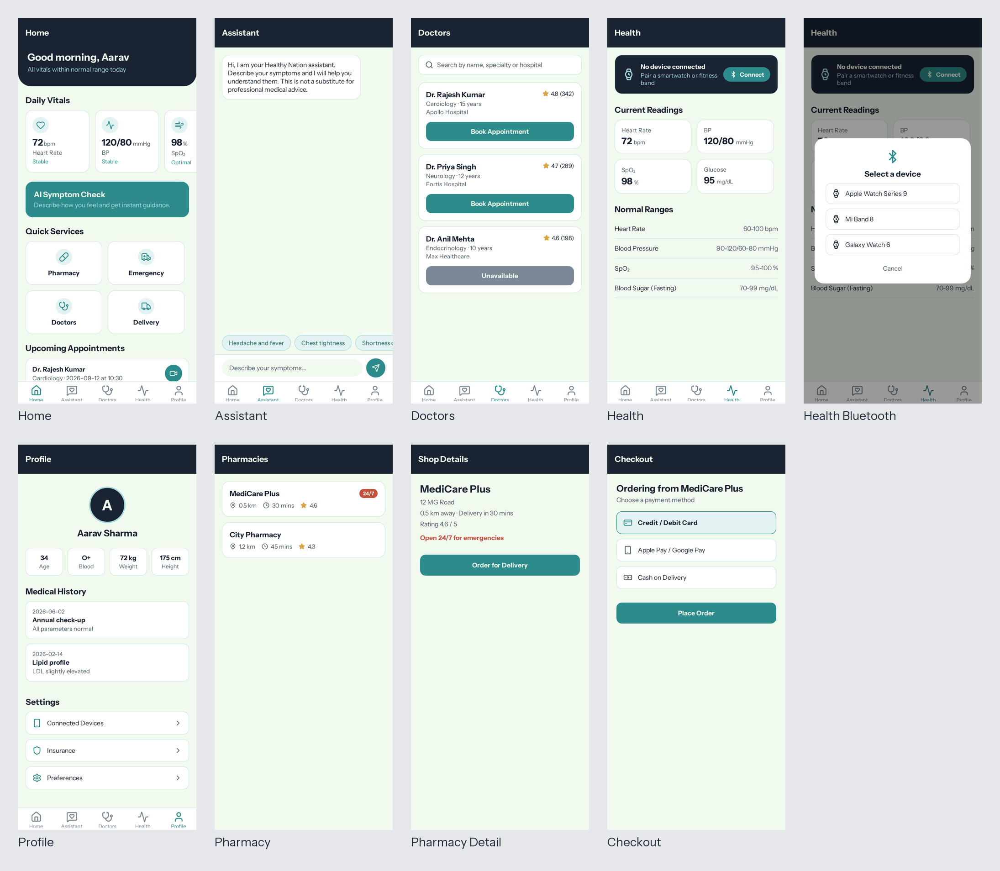

# Healthy Nation App

An AI-powered mobile health monitoring application designed to address early detection and remote monitoring of chronic diseases with access to quality healthcare.

## Features

### 1. Dashboard (Home Screen)
- **Daily Vitals**: Real-time health data (Heart Rate, SpO2, BP, Glucose) with trend indicators
- **AI Symptom Check Banner**: Quick access to health checkups
- **Upcoming Appointments**: List of scheduled doctor visits with video call options
- **Quick Services**: Fast access to Pharmacy, Emergency, Doctors, and Delivery

### 2. AI Health Assistant
- **Symptom Checker**: Describe symptoms and get AI-powered analysis
- **Health Parameter Monitoring**: Tracks normal and abnormal vital ranges
- **Emergency Alerts**: Immediate alerts for critical conditions
- **Medication Recommendations**: Personalized treatment suggestions

### 3. Find Doctors
- **Doctor Search**: Find specialists by condition
- **Doctor Profiles**: View experience, qualifications, and success rates
- **Rating System**: Hospital and doctor rankings based on customer service
- **Appointment Booking**: Schedule visits and online consultations

### 4. Profile & Medical History
- **Virtual Medical Records**: Complete health history without physical documents
- **Health Stats**: Quick overview of age, blood type, weight
- **Medical Timeline**: Past visits and results
- **Settings**: Connected devices, insurance, preferences

### 5. Pharmacy & Local Services
- **Medical Shop Locator**: Find nearby pharmacies with ratings
- **24/7 Emergency Shops**: Highlighted for emergency needs
- **Local Delivery**: Integration with local delivery apps
- **Payment Options**: Credit/Debit, Apple Pay, Cash on Delivery

### 6. Fitness Tracker Integration
- **Bluetooth Connection**: Seamless smartwatch/fitness band pairing
- **Health Metrics**: Heart Rate, Blood Pressure, SpO2, ECG, Body Composition
- **Distance Tracking**: Steps and distance walked
- **Real-time Sync**: Live data synchronization from wearable devices

## Design

The app uses the **Ocean Depths** theme from the bundled `theme-factory` skill:

| Role | Colour |
|---|---|
| Deep Navy `#1a2332` | headers, hero, primary text |
| Teal `#2d8b8b` | primary actions, active tab |
| Seafoam `#a8dadc` | secondary accents, chips |
| Cream `#f1faee` | app background |

Typography: Instrument Sans (Regular/Bold), loaded from `assets/fonts/` via `expo-font`.
Tokens live in `constants/colors.ts` and `constants/typography.ts`.

## Screenshots



Individual screens are in [`docs/screenshots/`](docs/screenshots/).

## Tech Stack

- **Framework**: React Native with Expo
- **Language**: TypeScript
- **Navigation**: Expo Router
- **Icons**: lucide-react-native
- **State Management**: React Hooks
- **AI Integration**: OpenAI/Perplexity API

## Requirements

- Node.js 20+ and npm
- Expo Go on your phone, or an iOS/Android simulator

## Installation

```bash
npm install
```

## Environment Variables

Create a `.env` file with:

```
EXPO_PUBLIC_OPENAI_API_KEY=your_api_key_here
```

## Running the App

```bash
npm start          # Expo dev server (scan QR with Expo Go)
npm run web        # Run in the browser
npm run lint       # ESLint
npm run typecheck  # TypeScript
```

## Project Structure

```
app/
  (tabs)/
    _layout.tsx      # Tab navigation
    index.tsx        # Home dashboard
    assistant.tsx    # AI chatbot
    doctors.tsx      # Doctor finder
    profile.tsx      # User profile
    health.tsx       # Health monitoring
  pharmacy/
    _layout.tsx      # Pharmacy routes
    index.tsx        # Shop listing
    [id].tsx         # Shop details
  checkout/
    index.tsx        # Checkout flow
  _layout.tsx        # Root layout
  +not-found.tsx     # Not found page

components/
  BluetoothScanner.tsx  # Device pairing UI

constants/
  colors.ts          # Color palette
  mocks.ts           # Mock data

lib/
  ai.ts              # OpenAI / Perplexity chat client
```

## Features in Detail

### Health Monitoring
- Heart Rate: 60-100 bpm (Normal)
- Blood Pressure: 90-120 / 60-80 mmHg
- SpO2: 95-100% (Normal)
- ECG: Normal Sinus Rhythm
- Blood Sugar: 70-99 mg/dL (Fasting)

### Wearable Devices
Supports integration with:
- Smartwatches (Apple Watch, Wear OS)
- Fitness Bands
- Health Rings

## API Integration

### OpenAI/Perplexity API
The app automatically detects your API key type (see `lib/ai.ts`):
- **OpenAI keys** (`sk-...`): Uses the `gpt-4o` model
- **Perplexity keys** (`pplx-...`): Uses the `sonar` model

If no key is set, the assistant runs in an offline fallback mode.

## License

MIT License

## Support

For issues and questions, please create an issue in the repository.
