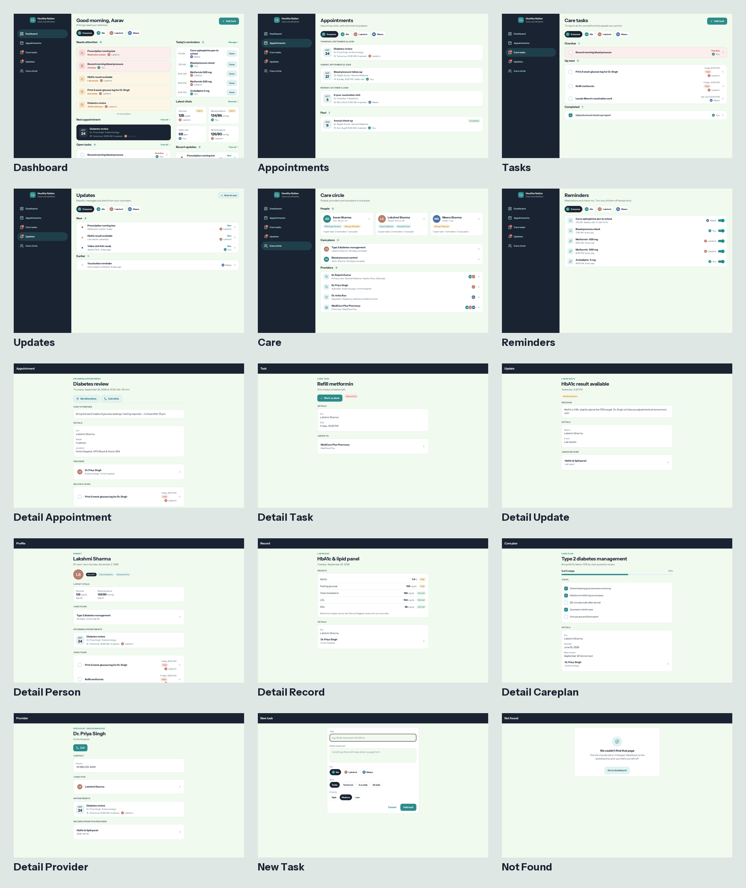
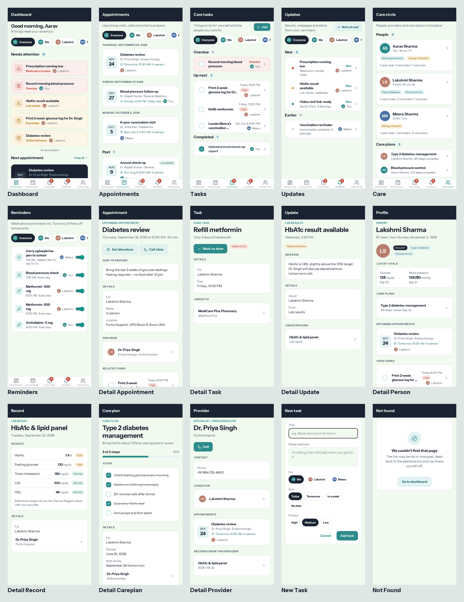

# Healthy Nation

A calm, personal healthcare dashboard and care-coordination app. See your health information in one place, keep track of appointments, care tasks, reminders and updates, and always know what needs attention next — for yourself and for the family members you care for.

Built with **Expo SDK 54 / React Native 0.81 / Expo Router 6 / TypeScript**. One codebase runs as a responsive web app (desktop sidebar, mobile bottom tabs) and as native iOS/Android apps.

## Screenshots

**Desktop**



**Mobile**



## What it does

| Area | Details |
|---|---|
| **Dashboard** | Ranked *Needs attention* list (urgent updates, overdue/today tasks, imminent appointments, due reminders), next appointment, today's reminders with one-tap "Done", latest vitals, recent updates. |
| **Care circle** | Switch between *Everyone* and each person (self, parent, child…). Every list filters accordingly. Person profiles show vitals, care plans, appointments, tasks, records, notes and providers. |
| **Appointments** | Upcoming visits grouped by day, past visits with summaries, prep notes, join-video / directions / call actions, linked tasks. |
| **Care tasks** | Overdue / up next / completed, priority, due dates, links to visits and providers. Quick "Add task" form. |
| **Reminders** | Medication and check-in schedules, pause/resume, acknowledged-today state. |
| **Updates** | Lab results, provider messages and alerts by severity; mark read / mark all read; links to underlying records. |
| **Records & care plans** | Structured lab values with flags, visit notes, prescriptions, vaccinations; care plans with goal, steps and progress. |
| **Empty states** | Every list has a friendly empty state explaining what will appear there. |

## Architecture

```
app/                     Expo Router routes
  (tabs)/                Dashboard, Appointments, Tasks, Updates, Care circle, Reminders
  appointments/[id]      Detail views
  tasks/[id], tasks/new
  updates/[id]  providers/[id]  people/[id]  records/[id]  care-plans/[id]
components/
  ui/                    Design system: Screen, Card, Text, Button, Badge, Avatar, ListRow, EmptyState…
  *.tsx                  Domain components (AttentionList, AppointmentCard, TaskRow, PersonSwitcher…)
lib/
  data/types.ts          Domain model (Person, Provider, Appointment, CareTask, Reminder, HealthUpdate,
                         HealthRecord, Vital, Note, CarePlan)
  data/seed.ts           Placeholder data (dates are relative to today)
  data/store.tsx         Local-first store: React context + AsyncStorage persistence
  data/selectors.ts      Derived views incl. the needsAttention() ranking
  format.ts              Date/label helpers
constants/               Theme tokens (Ocean Depths palette, Instrument Sans)
```

**Adding a real backend:** replace `lib/data/store.tsx` with an API-backed provider that exposes the same `useHealthData()` contract. Screens and selectors don't need to change. The data model already carries IDs, timestamps and per-person scoping.

## Getting started

```bash
npm install
npm run web        # browser (desktop + responsive mobile)
npm start          # Expo dev server — scan QR with Expo Go for native
npm run lint
npm run typecheck
```

Demo data is persisted in local storage after first load; clear site data (or call `resetToSeed()` from the store) to start fresh.

## Design

Theme **Ocean Depths** (from the bundled `theme-factory` skill): deep navy `#1a2332`, teal `#2d8b8b`, seafoam `#a8dadc`, cream `#f1faee`. Typography: Instrument Sans (OFL). Tokens in `constants/colors.ts` and `constants/typography.ts`.

## Testing

Playwright smoke test covering all routes at mobile and desktop widths, plus a task-toggle interaction:

```bash
pip install playwright && python3 -m playwright install chromium   # one-time
python3 .claude/skills/webapp-testing/scripts/with_server.py \
  --server "npx expo start --web --port 8081" --port 8081 \
  -- python3 tests/e2e/smoke_web.py
```

## License

MIT
